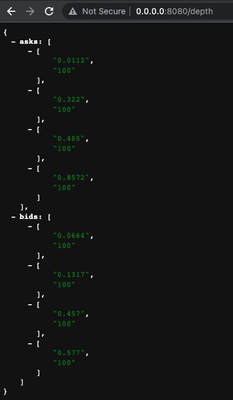

#### 交易系统撮合引擎
  一款使用golang编写的，采用优先级队列实现的订单排序、订单撮合、输出委托深度等的开源程序。

#### 功能列表
  - [x] 订单排序
  - [x] 输出委托深度
  - [ ] 订单撮合  

#### 委托深度预览
  

#### example
  [简单例子](#https://github.com/yzimhao/trading_engine/tree/master/example)