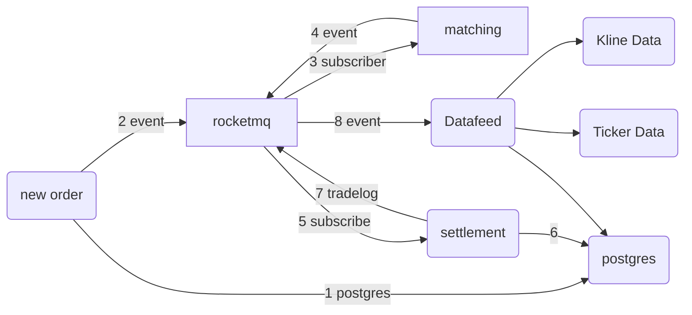
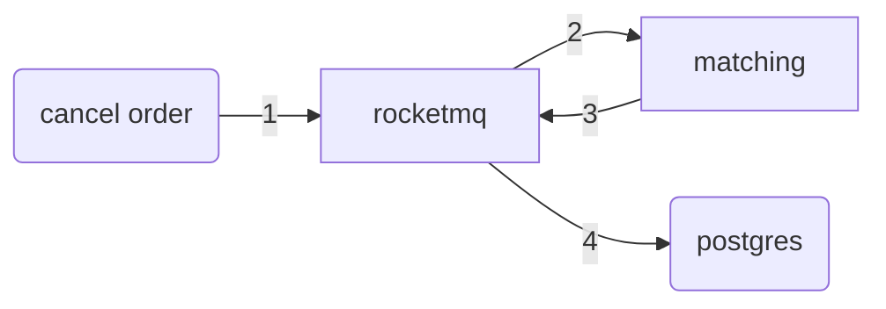

### 新订单

```mermaid
graph LR
    client(new order) --1 postgres --> db(postgres)
    client(new order) --2 event --> rocketmq --3 subscriber --> matching
    matching --4 event --> rocketmq
    rocketmq --5 subscribe --> settlement(settlement) --6--> db(postgres)
    settlement(settlement) --7 tradelog --> rocketmq
    rocketmq --8 event --> Datafeed(Datafeed)

    Datafeed(Datafeed) --> KlineData(Kline Data)
    Datafeed(Datafeed) --> tickerData(Ticker Data)
    Datafeed(Datafeed) --> db(postgres)
```

### 取消订单

```mermaid
graph LR
    client(cancel order) --1--> rocketmq
    rocketmq --2--> matching
    matching --3--> rocketmq
    rocketmq --4--> db(postgres)
```
