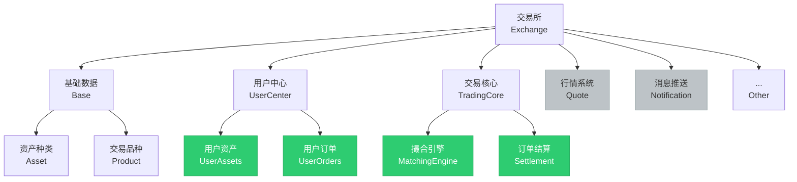

<p align="center">
    
    
	
	
	
</p>


#### 贡献代码
  全新重构，希望更多开源爱好者能加入共同开发练手，共同进步，请联系下方wx

#### Example
[demo project](http://157.250.198.95:8080/example/?symbol=btcusdt)


### 系统架构


<p align="center">
    
    
    
    
    
</p>

# trading_engine

轻量、可扩展的交易引擎示例（撮合引擎、订单处理、结算与通知），用于研究、演示与二次开发。

## 主要特点
- 高性能撮合引擎（限价/市价、优先撮合逻辑）
- 事件驱动的订单处理与结算流水
- 使用 `fx` 进行模块化依赖注入，支持快速组合与测试
- GORM + Postgres 持久化，Redis 用作缓存/消息队列（开发模式）
- 已包含示例前端（`frontend/example`）用于功能演示

## 目录结构与职责（简要）
- `cmd/`：程序入口与 CLI（迁移/运行/版本）
- `internal/di/`：依赖注入与 providers（Viper、Gorm、Redis、Gin 等）
- `internal/modules/`：业务模块（`base`, `tradingcore`, `usercenter`, `notification`, `quote`, `example`）
- `internal/persistence/`：Repository 接口与数据库实现
- `pkg/matching`：可复用撮合引擎包（含测试）
- `frontend/example`：示例前端（Vite + 框架）

## 快速开始

先确保已安装 `docker` 与 `docker-compose`。

1) 启动依赖服务（Postgres、Redis、RocketMQ (dev)）

```bash
docker compose up -d
```

2) 启动服务（开发模式）

```bash
# 在项目根目录
make run
```

3) 前端 demo（另开终端）

```bash
cd frontend/example
npm install
npm run dev:h5
# 打开浏览器: http://127.0.0.1:5174/example/?symbol=btcusdt
```

4) 数据库迁移（示例）

```bash
# 使用仓库提供的迁移脚本
make migrate-up
```

注意：仓库包含一个「仅在开发模式」的自动迁移实现，已对自动迁移策略进行改进（逐模型新增缺失列）。生产环境请使用可审计的 SQL migration 流程并禁用自动迁移。

## 开发与测试

- 代码风格：遵循 Go 约定，使用 `gofmt` / `go vet` / `golangci-lint`。
- 运行单元与包级测试：

```bash
# 运行所有测试（较大仓库建议按包运行）
go test ./... 
# 运行匹配模块测试（建议加 race 检测）
go test ./pkg/matching -race -v
```

## 核心模块参考 — 撮合引擎用法示例

撮合引擎封装为可复用包，典型用法：

```go
ctx := context.Background()
opts := []matching.Option{
        matching.WithPriceDecimals(2),
        matching.WithQuantityDecimals(2),
}
engine := matching.NewEngine(ctx, "btcusdt", opts...)

// 添加订单
engine.AddItem(item)
// 撤单
engine.RemoveItem(side, orderId, removeType)

// 订阅事件
engine.OnTradeResult(func(r matching_types.TradeResult) { /* handle */ })
engine.OnRemoveResult(func(r matching_types.RemoveResult) { /* handle */ })

// 获取深度
asks := engine.GetAskOrderBook(10)
bids := engine.GetBidOrderBook(10)
```

更多实现细节请查看 `pkg/matching` 源码与示例测试。

## 运行时/设计注意事项

- 自动迁移：已改为按模型新增缺失列以降低风险；生产环境仍建议禁用自动迁移并采用明确的 SQL migration。
- 认证：部分 API（如订单相关）受 JWT 中间件保护，调用时需携带有效 token（示例前端包含认证流程）。
- 消息队列：当前开发实现中 `Produce` 使用 Redis `LPUSH` 作为轻量消息通道；可按需替换为 RocketMQ 或其他中间件。

## 贡献

欢迎贡献：请先阅读代码、运行测试并在变更前提 issue 或 PR。建议流程：

1. Fork 仓库并创建新分支
2. 本地运行并验证变更：`go test ./...`、`golangci-lint run`
3. 提交 PR，并在描述中说明变更目的、影响范围与回归验证步骤

如果你希望参与核心模块（撮合/结算/迁移策略等），请先与仓库维护者讨论实现方案。


---

#### Star History

[](https://star-history.com/#yzimhao/trading_engine&Date)


