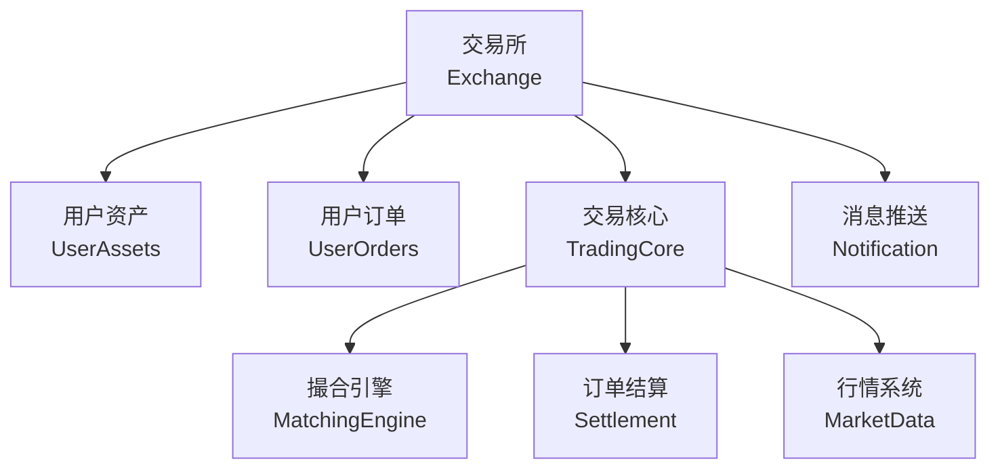

<p align="center">
    
    
	
	
	
</p>


#### 贡献代码
  全新重构，希望更多开源爱好者能加入共同开发练手，共同进步，请联系下方wx


### 系统架构


---

#### 撮合引擎
> 只集成撮合引擎部分

```
    go get github.com/yzimhao/trading_engine/v2/pkg/matching
```

```go
    ctx := context.Background()
    opts := []matching.Option{
        matching.WithPriceDecimals(2),
        matching.WithQuantityDecimals(2),
    }
    btcusdt = matching.NewEngine(ctx, "btcusdt", opts...)

    //添加订单
    btcusdt.AddItem(...)
    //移除订单
    btcusdt.RemoveItem(...)

    //监听事件结果
    btcusdt.OnTradeResult(func(result types.TradeResult) {
        //TODO
    })
    btcusdt.OnRemoveResult(func(result types.RemoveResult) {
        //TODO
    })

    //获取深度
    btcusdt.GetAskOrderBook(10) // [][2]string [["1.01","4.00"],["1.10","2.00"]]
    btcusdt.GetBidOrderBook(10)

```


 
  #### 交流


  #### Star History

[](https://star-history.com/#yzimhao/trading_engine&Date)

