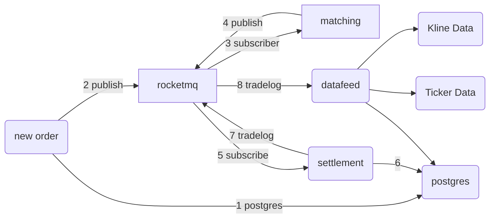

```mermaid
graph LR
    client(new order) --1 postgres --> db(postgres)
    client(new order) --2 publish --> rocketmq --3 subscriber --> matching
    matching --4 publish --> rocketmq
    rocketmq --5 subscribe --> settlement(settlement) --6--> db(postgres)
    settlement(settlement) --7 tradelog --> rocketmq
    rocketmq --8 tradelog --> datafeed(datafeed)

    datafeed(datafeed) --> KlineData(Kline Data)
    datafeed(datafeed) --> tickerData(Ticker Data)
    datafeed(datafeed) --> db(postgres)
```
